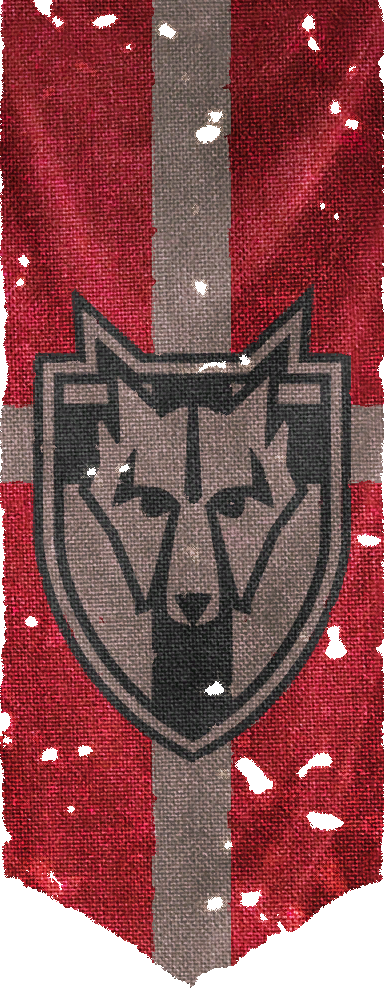

# **Welcome, dragonborn!**

## **About Me:**

- 🌎 **Made in Brazil**

- 📨 **Skills on front-end an teamwork**

- 📚 **High School Student | Game Design**

- 👓 **Currently focusing on learning back-end**

- 💻 **I have preference in linux for its practicality**

- 🍿 **I don't play too many games, so I have a preference to spend my time reading about projects on github**

---

## **My status:**

### Knowledge:

---

### Found Me:

  
  